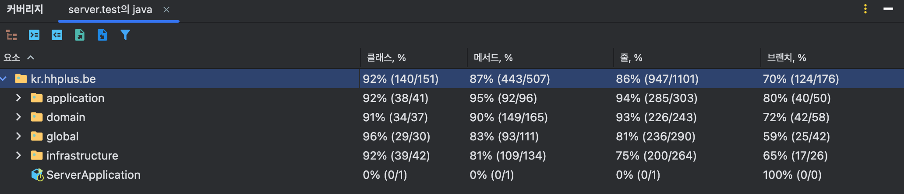

# **🛒 대규모 트래픽을 가정한 E-Commerce 백엔드 시스템**
**Spring Boot 기반의 E-Commerce 상품 주문 서비스입니다.**

본 프로젝트는 초기에는 **40명 동시 사용자조차 감당하지 못했던 서비스를**,
클린 아키텍처 기반의 구조 개선과 단계적 최적화를 통해
**안정적으로 수십 배 더 많은 부하를 처리할 수 있는 시스템**으로 발전시킨 경험을 담고 있습니다.

최종 성과:
- **p95 응답 시간: 29.46s → 75.48ms (99.7% 단축)**
- **에러율: 53건 → 0건 (100% 감소)**
- **RPS(평균): 9.7 → 34.1 (252% 증가)**
- **코드 품질**: Jacoco/IntelliJ 기준 전체 라인 커버리지 85% 달성

본 프로젝트에서는 Redis 분산 락, Kafka 기반 비동기 메시징, Redis 캐싱 등을 적용하여
동시성 문제와 데이터 일관성을 해결했으며,
k6 부하 테스트로 병목을 데이터 기반으로 분석하고 개선 효과를 수치로 검증했으며, 
높은 테스트 커버리지를 통해 복잡한 비즈니스 로직의 신뢰도를 확보했습니다.

IntelliJ 테스트 커버리지 분석 결과 (**Line: 85%, Method: 92%**)

## **📚 목차**

1. [성능 개선](#1--성능-개선)  
2. [기술 스택](#2--기술-스택)  
3. [주요 기능](#3-주요-기능)   
4. [아키텍처](#4-아키텍처)
5. [기술적 도전과 해결 과정](#5-기술적-도전과-해결-과정)
6. [전체 설계 및 기술 문서](#6-docs-전체-설계-및-기술-문서)

## **1. 🚀 성능 개선**

k6를 이용한 부하 테스트를 통해 시스템의 한계점을 측정하고, 단계별 튜닝으로 성능을 개선했습니다.

* **문제**: 초기 테스트 결과, **동시 접속자 40명(40 VUs)** 수준에서 DB 커넥션 풀 고갈로 인해 p95 응답 시간이 29.46초까지 증가하면서 시스템 장애 발생.
* **해결**:
    1. **DB 커넥션 풀 튜닝**: 시스템 장애의 직접적인 원인이었던 DB 커넥션 병목을 해결하여 안정성을 확보.
    2. **Redis 캐싱 적용**: 가장 빈번하게 호출되던 API에 캐싱을 적용하여 DB 부하를 줄이고 응답 속도를 최적화.
    3. **DB 인덱스 추가**: `EXPLAIN` 으로 발견한 잠재적 비효율(풀 테이블 스캔)을 선제적으로 제거하여 확장성을 확보.  

### **최종 개선 결과 (40 VUs 기준)**

| 지표            | 1차 (Baseline) | 4차 (최종 개선 후) | 개선율          |
|:--------------|:--------------|:-------------|:-------------|
| **테스트 결과**    | **실패**        | **성공**       | **안정성 확보**   |
| **에러 수**      | 53 건          | **0 건**      | **100% 감소**  |
| **p95 응답 시간** | 29.46 s       | **75.47 ms** | **99.7% 감소** |
| **RPS(평균)**   | ~9.7          | **34.1**     | **252% 증가**  |

[**➡️ 전체 부하 테스트 및 성능 개선 보고서 보기**](/docs/report/7.부하%20테스트%20및%20성능%20개선.md)

## 2. 기술 스택

| 구분 | 기술 |
| :--- | :--- |
| **Backend** | `Java 17`, `Spring Boot 3.4`, `Spring Data JPA` |
| **Database & Cache** | `MySQL 8.0`, `Redis`, `Redisson` |
| **Message Queue & Event** | `Kafka`, `Server-Sent Events (SSE)` |
| **Infrastructure** | `Docker`, `Docker Compose` |
| **Testing** | `JUnit 5`, `Testcontainers`, `Spring Boot Test`, `Awaitility`, `k6` (Load Testing) |
| **Monitoring** | `Spring Boot Actuator`, `InfluxDB`, `Grafana` |
| **API Documentation** | `Swagger (OpenAPI)` |

## **3. 주요 기능**
* **포인트 관리**: 사용자의 포인트를 충전하고 현재 잔액을 조회합니다.  
* **상품 조회**: 상품의 상세 정보와 실시간 재고를 조회합니다.  
* **주문 및 결제**: 상품 재고, 쿠폰, 사용자 포인트를 고려하여 주문을 생성하고 결제를 처리합니다.  
* **선착순 쿠폰 발급**: 한정된 수량의 쿠폰을 동시성 문제없이 안전하게 발급합니다.  
* **인기 상품 조회**: 최근 3일간 가장 많이 팔린 상품의 랭킹을 제공합니다.

## **4. 아키텍처**
해당 프로젝트는 **클린 아키텍처(Clean Architecture)** 를 기반으로 설계하여, 핵심 비즈니스 로직(Domain)을 외부 기술(Infrastructure)로부터 분리하고 시스템의 유연성, 테스트 용이성, 유지보수성을 극대화했습니다.
* **의존성 규칙**: 모든 의존성은 외부(Infrastructure)에서 내부(Domain)로 향하며, 핵심 비지니스 로직을 외부 기술 변화로부터 보호합니다.  
* **관심사 분리**: 도메인, 애플리케이션, 인프라스트럭처 계층으로 역할을 명확히 분리하여 코드의 복잡도를 낮춥니다.

### **주요기능 및 아키텍처 링크들**
- [요구사항 분석](/docs/01_Requirements_Analysis.md)
- [아키텍처 설계](/docs/05_Architecture.md)
- [ERD 및 도메인 모델](/docs/03_erd.md)
- [핵심 시퀀스 다이어그램](/docs/02_Sequence_Diagram.md)
- [주요 기능 플로우 차트](/docs/04_flowchart.md)

## **5. 기술적 도전과 해결 과정**

대규모 트래픽을 가정한 시뮬레이션 환경에서 발생할 수 있는 주요 문제들을 해결하기 위해 다음과 같은 기술적 전략을 적용했습니다.

### **5.1 동시성 제어: DB Lock vs. 분산 락**

* **Pessimistic Lock (비관적 락)**: 동시 충돌 가능성이 높고 데이터 정합성이 매우 중요한 **포인트 차감** 로직에 적용하여 안전성을 확보했습니다.  
* **Distributed Lock (분산 락 with Redisson)**: 여러 서버 인스턴스로 확장될 상황을 고려하여, **선착순 쿠폰 발급**과 같이 경쟁이 극심한 기능에 Spin Lock과 Full Jitter 백오프 전략을 결합한 분산 락을 적용했습니다.

[➡️ 동시성 제어 전략 상세 분석](docs/report/1.동시성%20락%20정리.md)  
[➡️ 분산 락 적용 과정 보기](docs/report/2.분산락%20적용.md)

### **5.2 비동기 처리: 이벤트 기반 아키텍처**

* **Kafka & Saga Pattern**: 주문, 재고, 쿠폰 등 각 도메인 서비스 간의 강한 결합을 막기 위해 Kafka 또는 도메인 이벤트 이용한 이벤트 기반의 **Choreography Saga 패턴**을 적용했습니다. 이를 통해 분산 트랜잭션의 일관성을 유지하고 시스템의 유연성을 높였습니다.

[**➡️ Kafka 적용 및 Outbox 패턴 분석**](/docs/report/5.카프카%20정리.md)

[**➡️ 이벤트 기반 주문 생성 로직 구현**](/docs/report/4.주문%20생성.md)

[**➡️ 이벤트 기반 주문 생성 로직 구현 테스트 작성 시 회고**](/docs/report/8.주문%20생성%20구현%20회고.md)

### **5.3 실시간 처리: Redis 자료구조 활용**
레디스 자료구조에 대해 정리하고 선착순 쿠폰 발급과 인기 상품 랭킹 구현에 적절한 자료구조를 사용했습니다.

* **선착순 쿠폰 발급**: **Redis Set**을 활용하여 중복 발급 여부를 O(1)로 빠르게 확인하고, **Atomic 연산**으로 재고를 안전하게 차감하여 동시성 문제를 해결했습니다.  
* **인기 상품 랭킹**: **Redis Sorted Set**을 활용하여, 스케줄러가 하루에 한 번 최근 3일간의 데이터를 집계하여 랭킹을 제공합니다.

[➡️ Redis 자료구조 활용 설계 보기](/docs/report/3.레디스%20자료구조.md)

[➡️ 실시간 쿠폰 발급 시스템 설계 보기](/docs/report/6.실시간쿠폰.md)

## **6. Docs: 전체 설계 및 기술 문서**
### **📐 설계 문서**
- [아키텍처](./docs/05_Architecture.md)
- [시퀀스 다이어그램](./docs/02_Sequence_Diagram.md)
- [설계 문서](./docs/01_Requirements_Analysis.md)
- [ERD](./docs/03_erd.md)
- [플로우차트](./docs/04_flowchart.md)

### **🛠️ 기술 정리 및 회고**
- [동시성 락 정리](./docs/report/1.동시성%20락%20정리.md)
- [분산락 적용](./docs/report/2.분산락%20적용.md)
- [레디스 자료구조](./docs/report/3.레디스%20자료구조.md)
- [주문 생성](./docs/report/4.주문%20생성.md)
- [주문 생성 구현 회고](./docs/report/8.주문%20생성%20구현%20회고.md)
- [카프카 정리](./docs/report/5.카프카%20정리.md)
- [실시간 쿠폰](./docs/report/6.실시간쿠폰.md)
- [부하 테스트 및 성능 개선](./docs/report/7.부하%20테스트%20및%20성능%20개선.md)
