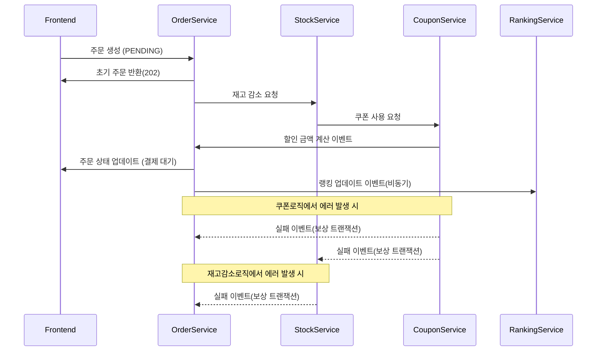
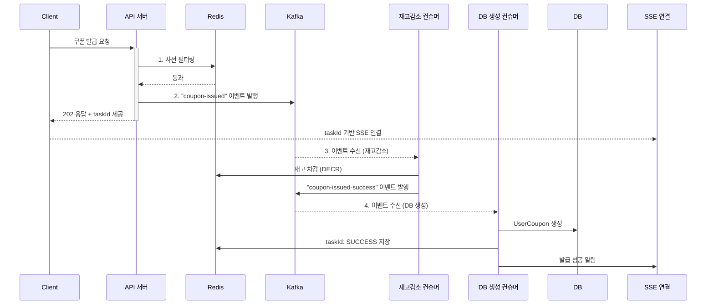
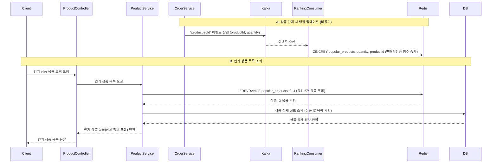

# ✅ 핵심 시퀀스 다이어그램
## 목차
- [요구사항 분석](01_Requirements_Analysis.md)
- [ERD](03_erd.md)
- [핵심 로직 다이어그램](02_Sequence_Diagram.md)
- [플로우 차트](04_flowchart.md)
- [아키텍처 및 패키지 구조](05_Architecture.md)
- [↩️ README로 돌아가기](../README.md#주요기능-및-아키텍처-링크들)

### 1. 주문 & 결제 시퀀스 다이어그램

**이벤트 기반 주문 프로세스 (Choreography Saga)**
주문, 재고, 쿠폰 등 각 도메인 서비스가 강하게 결합되는 것을 막기 위해 이벤트 기반의 Choreography Saga 패턴을 적용했습니다.
1.  **주문 생성**: `OrderService`는 `PENDING` 상태의 주문을 먼저 생성하고 즉시 응답합니다.
2.  **이벤트 발행/구독**: `OrderService`가 발행한 `OrderCreated` 이벤트를 `StockService`가 구독하여 재고를 처리하고, `StockService`가 발행한 이벤트를 `CouponService`가 구독하여 쿠폰을 처리하는 등 각 서비스가 독립적으로 다음 단계를 수행합니다.
3.  **보상 트랜잭션**: 재고 감소나 쿠폰 사용 단계에서 실패가 발생하면, 각 서비스는 실패 이벤트를 발행하여 이전 단계의 서비스들이 보상 트랜잭션을 수행하도록 합니다. (e.g., 재고 원복)
4.  **최종 일관성**: 모든 과정이 비동기로 처리되므로 데이터는 최종적으로 일관성을 갖추게 되며, 이를 통해 서비스 간의 결합도를 낮추고 시스템 전체의 유연성과 확장성을 확보합니다.

**[자세히 보기: 4. 주문 생성](/docs/report/4.주문%20생성.md)**

### 2. 쿠폰 사용 다이어그램

**Kafka와 SSE를 이용한 실시간 쿠폰 발급**

대규모 트래픽에서도 안정적인 선착순 쿠폰 발급을 위해 Kafka와 SSE를 도입했습니다.

1.  **사전 필터링 및 이벤트 발행**: API 서버는 Redis를 통해 간단한 중복 요청을 필터링한 후, 발급 요청을 즉시 Kafka 이벤트(`coupon-issued`)로 발행하고 사용자에게 `taskId`를 포함한 202 응답을 보냅니다.
2.  **비동기 처리**: `StockConsumer`와 `DBConsumer`가 Kafka 이벤트를 구독하여 각각 Redis 재고 차감과 DB 저장을 비동기적으로 처리합니다. 이를 통해 API 서버의 부하를 최소화하고 요청을 안전하게 처리합니다.
3.  **실시간 결과 알림**: 사용자는 발급 요청 시 받은 `taskId`를 이용해 SSE(Server-Sent Events) 연결을 맺습니다. `DBConsumer`가 최종 처리를 완료하면, SSE를 통해 사용자에게 실시간으로 발급 성공/실패 결과를 알려주므로, 불필요한 Polling 요청 없이 사용자 경험을 향상시킵니다.

**[자세히 보기: 6. 실시간 쿠폰](/docs/report/6.실시간쿠폰.md)**

### 3. 인기 상품 다이어그램

**Kafka와 Redis를 이용한 실시간 인기 상품 집계**

실시간으로 가장 많이 팔린 상품을 집계하여 사용자에게 보여주기 위해 Kafka와 Redis를 활용합니다.
1.  **판매 데이터 비동기 처리**: 주문이 완료되면 `OrderService`는 `product-sold` 이벤트를 Kafka로 발행합니다. 이 방식은 주문 처리의 본질적인 흐름에 영향을 주지 않으면서 랭킹 집계 로직을 완전히 분리하는 장점이 있습니다.

2.  **실시간 랭킹 업데이트**: `RankingConsumer`는 Kafka로부터 이벤트를 받아 Redis의 `Sorted Set` 자료구조에 상품의 판매량(`quantity`)을 점수(`score`)로 하여 누적합니다. `ZINCRBY` 명령어는 원자적으로 연산을 수행하므로 데이터 정합성을 보장하며, 매우 빠른 속도로 랭킹을 갱신할 수 있습니다.

3.  **인기 상품 목록 조회**: 사용자가 인기 상품 조회를 요청하면, `ProductService`는 Redis의 `ZREVRANGE` 명령어를 통해 가장 점수가 높은 상품 ID 목록을 빠르게 조회합니다. 이후 이 ID 목록을 기반으로 DB에서 상세 상품 정보를 가져와 사용자에게 최종 결과를 반환합니다.