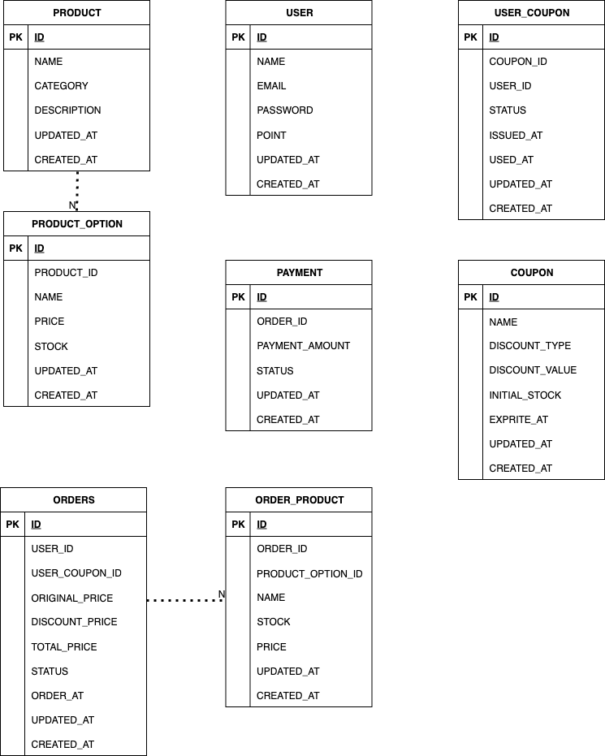

# ✅ 주요 Diagram
## 목차
- [요구사항 분석](01_Requirements_Analysis.md)
- [ERD](03_erd.md)
- [핵심 로직 다이어그램](02_Sequence_Diagram.md)
- [플로우 차트](04_flowchart.md)
- [아키텍처 및 패키지 구조](05_Architecture.md)
- [↩️ README로 돌아가기](../README.md#주요기능-및-아키텍처-링크들)

## ✅ Domain Class Diagram


## ✅ ERD


### 테이블 설명
| 테이블명             | 책임 설명                                              |
|------------------|----------------------------------------------------|
| `user`           | 사용자 정보를 저장 및 보유 포인트 정보를 관리                         |
| `product`        | 상품의 기본 정보(이름, 카테고리, 가격 등)를 관리                      |
| `product_option` | 상품에 대한 세부 옵션(색상, 사이즈 등)과 재고를 관리                    |
| `orders`         | 사용자의 주문 전체를 대표하는 정보와 상태(PENDING, COMPLETED 등)를 저장  |
| `order_product`  | 주문에 포함된 각 상품 옵션의 수량, 금액 등 세부 정보를 관리                |
| `payment`        | 주문에 대한 결제 정보 및 결제 상태를 관리 (성공/실패/환불 등)              |
| `coupon`         | 발급 가능한 쿠폰 정보(할인 방식, 금액, 유효기간 등)를 정의                |
| `coupon_stock`   | 쿠폰의 현재 재고를 정보를 정의(실시간 발급을 위한 쿠폰의 정규화) - redis에서 처리 |
| `user_coupon`    | 사용자에게 발급된 쿠폰 정보(사용 여부, 만료일 등)를 관리                  |

## 테이블 생성 쿼리 (DDL)

```mysql
CREATE TABLE `user` (
    `id` BIGINT NOT NULL AUTO_INCREMENT COMMENT '사용자 ID',
    `name` VARCHAR(20) NOT NULL COMMENT '사용자 이름',
    `email` VARCHAR(50) NOT NULL COMMENT '사용자 이메일',
    `password` VARCHAR(255) NOT NULL COMMENT '사용자 비밀번호',
    `point` BIGINT NOT NULL COMMENT '사용자 포인트',
    `created_at` DATETIME(6) NOT NULL COMMENT '생성 시간',
    `updated_at` DATETIME(6) NOT NULL COMMENT '수정 시간',
    PRIMARY KEY (`id`),
    UNIQUE KEY `UK_user_email` (`email`) -- 유니크 설정은 자동으로 인덱스가 들어감.
) DEFAULT CHARSET=utf8mb4 COLLATE=utf8mb4_unicode_ci;

CREATE TABLE `user_coupon` (
    `id` BIGINT NOT NULL AUTO_INCREMENT COMMENT '사용자 쿠폰 ID',
    `user_id` BIGINT NOT NULL COMMENT '사용자 ID',
    `coupon_id` BIGINT NOT NULL COMMENT '쿠폰 ID',
    `status` VARCHAR(255) NOT NULL COMMENT '쿠폰 상태 (ISSUED, USED)',
    `issued_at` DATETIME(6) NOT NULL COMMENT '발급 시간',
    `used_at` DATETIME(6) NULL COMMENT '사용 시간',
    `created_at` DATETIME(6) NOT NULL COMMENT '생성 시간',
    `updated_at` DATETIME(6) NOT NULL COMMENT '수정 시간',
    PRIMARY KEY (`id`),
    KEY idx_user_coupon (`user_id`, `coupon_id`)
) DEFAULT CHARSET=utf8mb4 COLLATE=utf8mb4_unicode_ci;

CREATE TABLE `product` (
    `id` BIGINT NOT NULL AUTO_INCREMENT COMMENT '상품 ID',
    `name` VARCHAR(30) NOT NULL COMMENT '상품 이름',
    `category` VARCHAR(255) NOT NULL COMMENT '상품 카테고리',
    `description` VARCHAR(200) NOT NULL COMMENT '상품 설명',
    `created_at` DATETIME(6) NOT NULL COMMENT '생성 시간',
    `updated_at` DATETIME(6) NOT NULL COMMENT '수정 시간',
    PRIMARY KEY (`id`)
) DEFAULT CHARSET=utf8mb4 COLLATE=utf8mb4_unicode_ci;

CREATE TABLE `product_option` (
    `id` BIGINT NOT NULL AUTO_INCREMENT COMMENT '상품 옵션 ID',
    `product_id` BIGINT NOT NULL COMMENT '상품 ID',
    `name` VARCHAR(30) NOT NULL COMMENT '옵션 이름',
    `price` BIGINT NOT NULL COMMENT '가격',
    `stock` INT NOT NULL COMMENT '재고',
    `created_at` DATETIME(6) NOT NULL COMMENT '생성 시간',
    `updated_at` DATETIME(6) NOT NULL COMMENT '수정 시간',
    PRIMARY KEY (`id`),
    KEY idx_product_id (`product_id`)
) DEFAULT CHARSET=utf8mb4 COLLATE=utf8mb4_unicode_ci;

CREATE TABLE `payment` (
    `id` BIGINT NOT NULL AUTO_INCREMENT COMMENT '결제 ID',
    `order_id` BIGINT NOT NULL COMMENT '주문 ID',
    `payment_amount` BIGINT NOT NULL COMMENT '결제 금액',
    `status` VARCHAR(255) NOT NULL COMMENT '결제 상태',
    `created_at` DATETIME(6) NOT NULL COMMENT '생성 시간',
    `updated_at` DATETIME(6) NOT NULL COMMENT '수정 시간',
    PRIMARY KEY (`id`)
) DEFAULT CHARSET=utf8mb4 COLLATE=utf8mb4_unicode_ci;

CREATE TABLE `orders` (
    `id` BIGINT NOT NULL AUTO_INCREMENT COMMENT '주문 ID',
    `user_id` BIGINT NOT NULL COMMENT '사용자 ID',
    `user_coupon_id` BIGINT NULL COMMENT '사용자 쿠폰 ID',
    `original_price` BIGINT NOT NULL COMMENT '원래 가격',
    `discount_price` BIGINT NOT NULL COMMENT '할인된 가격',
    `total_price` BIGINT NOT NULL COMMENT '최종 결제 가격',
    `status` VARCHAR(255) NOT NULL COMMENT '주문 상태',
    `order_at` DATETIME(6) NOT NULL COMMENT '주문 시간',
    `created_at` DATETIME(6) NOT NULL COMMENT '생성 시간',
    `updated_at` DATETIME(6) NOT NULL COMMENT '수정 시간',
    PRIMARY KEY (`id`)
) DEFAULT CHARSET=utf8mb4 COLLATE=utf8mb4_unicode_ci;

CREATE TABLE `order_product` (
    `id` BIGINT NOT NULL AUTO_INCREMENT COMMENT '주문 상품 ID',
    `order_id` BIGINT NOT NULL COMMENT '주문 ID',
    `product_option_id` BIGINT NOT NULL COMMENT '상품 옵션 ID',
    `product_name` VARCHAR(30) NOT NULL COMMENT '상품 이름 (스냅샷)',
    `product_stock` INT NOT NULL COMMENT '상품 수량 (스냅샷)',
    `product_price` BIGINT NOT NULL COMMENT '상품 가격 (스냅샷)',
    `created_at` DATETIME(6) NOT NULL COMMENT '생성 시간',
    `updated_at` DATETIME(6) NOT NULL COMMENT '수정 시간',
    PRIMARY KEY (`id`),
    KEY idx_order_id (`order_id`)
) DEFAULT CHARSET=utf8mb4 COLLATE=utf8mb4_unicode_ci;

CREATE TABLE `coupon` (
    `id` BIGINT NOT NULL AUTO_INCREMENT COMMENT '쿠폰 ID',
    `name` VARCHAR(30) NOT NULL COMMENT '쿠폰 이름',
    `discount_type` VARCHAR(255) NOT NULL COMMENT '할인 타입 (PERCENT, FIXED)',
    `discount_value` BIGINT NOT NULL COMMENT '할인 값',
    `initial_stock` INT NOT NULL COMMENT '초기 수량',
    `expire_at` DATETIME(6) NOT NULL COMMENT '만료 시간',
    `created_at` DATETIME(6) NOT NULL COMMENT '생성 시간',
    `updated_at` DATETIME(6) NOT NULL COMMENT '수정 시간',
    PRIMARY KEY (`id`)
) DEFAULT CHARSET=utf8mb4 COLLATE=utf8mb4_unicode_ci;
```