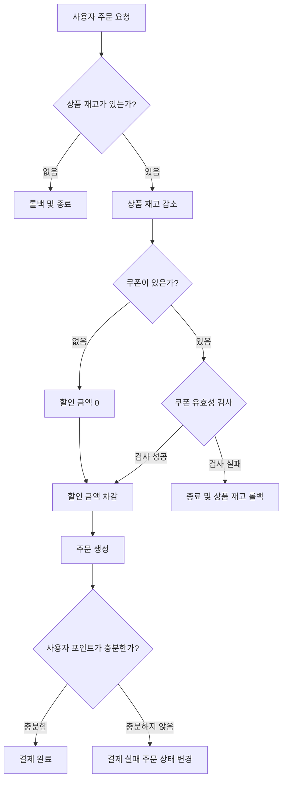
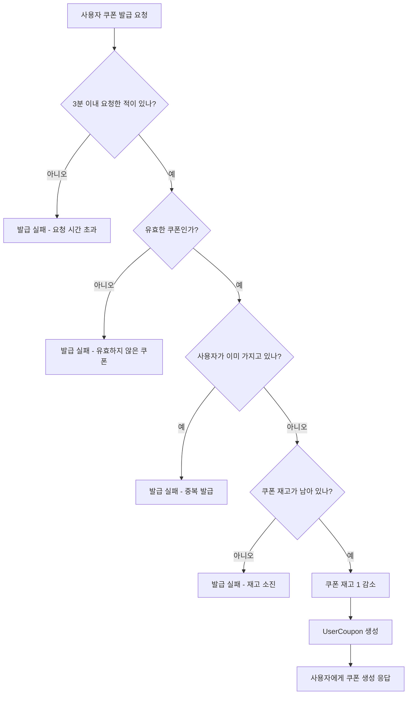

# 주요 기능 플로우 차트
## 목차
- [요구사항 분석](01_Requirements_Analysis.md)
- [ERD](03_erd.md)
- [핵심 로직 다이어그램](02_Sequence_Diagram.md)
- [플로우 차트](04_flowchart.md)
- [아키텍처 및 패키지 구조](05_Architecture.md)
- [↩️ README로 돌아가기](../README.md#주요기능-및-아키텍처-링크들)

## 주문 생성

## 실시간 쿠폰 발급
