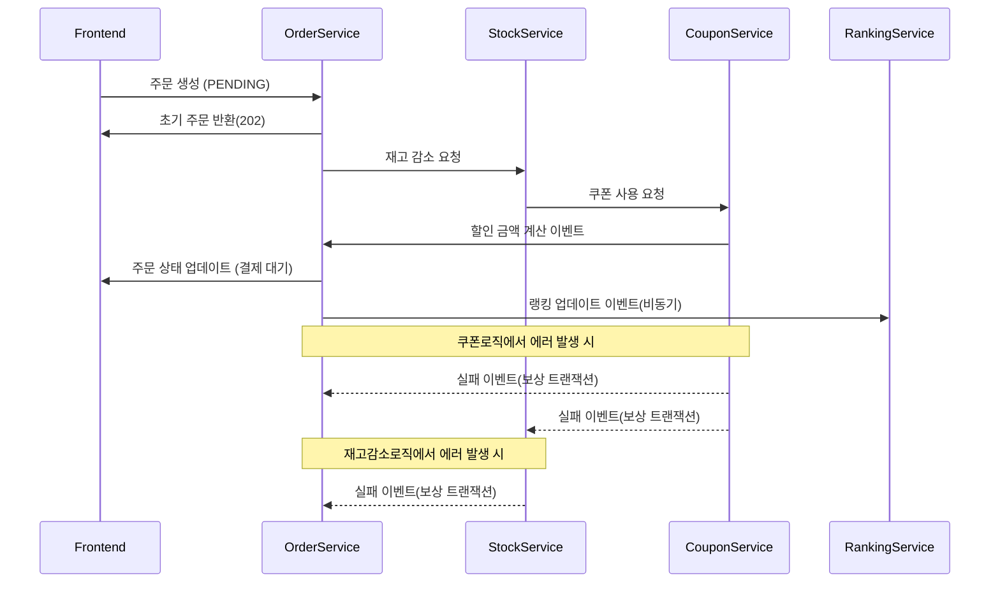

# 도메인 분리에 따른 분산 트랜잭션 처리 전략

## 1. 배경 및 문제 정의
현재의 모놀리식 아키텍처로 개발된 이커머스는 서비스 규모가 확장됨에 따라 다음과 같은 한계에 직면할 수 있습니다.

- **강한 결합**: 여러 도메인(주문, 상품, 쿠폰)의 코드가 섞여 있어 수정 및 변경이 어렵고 서로에게 미치는 영향을 예측하기 힘듭니다.
- **배포 효율 저하**: 코드베이스 전체를 빌드/배포해야 하므로 속도가 느리고 과정이 복잡합니다.
- **성능 병목**: 여러 도메인을 아우르는 단일 트랜잭션은 DB 락(Lock) 점유 시간을 늘려 시스템 전체의 동시 처리를 방해합니다.

이러한 문제를 해결하기 위해 도메인별 서비스 분리가 필요하며, 이 과정에서 발생하는 분산 트랜잭션 처리 문제가 최우선 과제입니다.

## 2. 대응 방안 및 설계 전략

트랜잭션 일관성을 위해 다음 전략을 검토했습니다.

### 2PC (Two-Phase Commit)
- 트랜잭션의 원자성을 보장합니다.
- 락을 사용하므로 성능 저하 가능성이 있습니다.
- 장애 발생 시 복구가 복잡합니다.

### Saga 패턴
- 트랜잭션을 작은 단위로 나누고, 단계별 실패 시 보상 트랜잭션을 실행합니다.
- 2가지 구현 방식이 존재합니다.
  1. **오케스트라 사가**: 중앙에서 트랜잭션 흐름 제어, 로직 확인 용이, 책임 집중 문제 발생
  2. **코레오그래피 사가**: 각 도메인이 이벤트를 구독하여 독립적 처리, 책임 분산, 로직 추적 어려움

**코레오그래피 사가 선택 이유**: 도메인 간 의존성 최소화와 독립성을 중요하게 고려하여 코레오그래피 사가 패턴을 채택했습니다.

## 3. 상세 설계: 이벤트 기반 주문 프로세스

### 3.1. 성공 시나리오
1. **주문 생성**: 클라이언트의 요청을 받은 Order Service는 PENDING 상태의 주문을 생성하고 OrderCreatedEvent를 발행
2. **재고 처리**: Stock Service가 이벤트를 구독하여 재고를 차감하고, 가격 정보가 포함된 StockDecreasedEvent를 발행
3. **쿠폰 처리**: Coupon Service가 이벤트를 구독하여 쿠폰을 사용 처리하고, 할인 정보가 포함된 CouponUsedEvent를 발행
4. **주문 확정**: Order Service가 다시 CouponUsedEvent를 구독하여, 최종 가격과 함께 주문 상태를 AWAITING_PAYMENT로 변경
5. **후속 처리**: 주문 확정 후, Order Service는 랭킹 업데이트 등을 위해 OrderCompletedEvent를 발행하며, 관련 서비스들이 이를 비동기적으로 처리

### 3.2. 실패 및 보상 시나리오
- **재고 처리 단계 실패 시**
  - Stock Service에서 StockDecreaseFailedEvent 발행  
  - Order Service는 주문 상태를 FAILED로 변경

- **쿠폰 처리 단계 실패 시**
  - Coupon Service는 CouponUseFailedEvent를 발행  
  - Order Service는 주문 상태를 FAILED로 변경  
  - Stock Service는 보상 트랜잭션 실행으로 이전에 성공적으로 차감한 재고를 원복

### 3.3. 클라이언트 상호작용
- 주문 생성(POST) 요청 시, 서버는 즉시 202 Accepted 상태와 함께 PENDING 상태의 주문 정보 및 상태를 조회할 수 있는 API의 Location을 반환합니다.  
- 클라이언트는 이 API를 주기적으로 **폴링(Polling)**하여 최종 상태(AWAITING_PAYMENT 또는 FAILED)를 확인하고 UI를 업데이트합니다.

## 4. 기대 효과 및 고려사항
- **기대 효과**
  - 의존성 분리: 공유 이벤트(Shared Event)를 통해 각 도메인 서비스의 자율성을 확보합니다.
  - 성능 향상: 짧은 로컬 트랜잭션으로 DB 락 시간을 최소화하고, 비핵심 기능(랭킹)을 비동기 처리하여 응답성을 높입니다.
  - 탄력성 증가: 특정 서비스의 장애가 다른 서비스로 직접 전파되지 않습니다.

- **고려사항**
  - 구현 복잡도: 이벤트, 리스너, 보상 로직 등 관리 포인트가 증가하여 동기식 모델보다 복잡합니다.
  - 최종 일관성: 데이터가 일관성을 갖추기까지 짧은 지연이 발생할 수 있습니다.
  - 디버깅: 전체 트랜잭션 흐름을 추적하기 어려워 분산 추적 시스템 도입이 권장됩니다.

> **추가 참고:**  
> 설계 이후 실제 구현 및 성능 검증 과정에서 발견된 문제점과 개선 사항은  
> [주문 생성 회고](./8.주문%20생성%20구현%20회고.md)에서 자세히 다루었습니다.

## 5. 결론
코레오그래피 사가 패턴은 분산 환경에서의 트랜잭션 처리 복잡도를 증가시키는 대신,  
서비스 간 결합도를 낮추고 시스템 전체의 유연성과 확장성을 크게 향상시키는 효과적인 아키텍처 전략입니다.