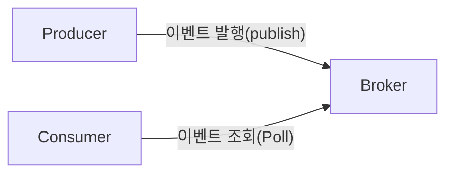
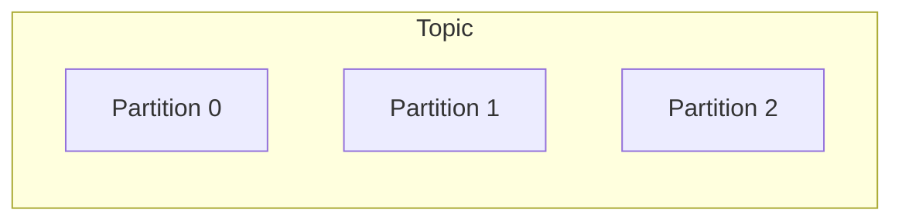
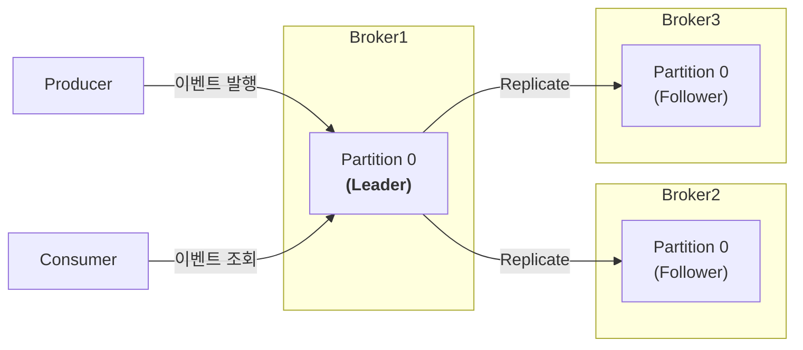
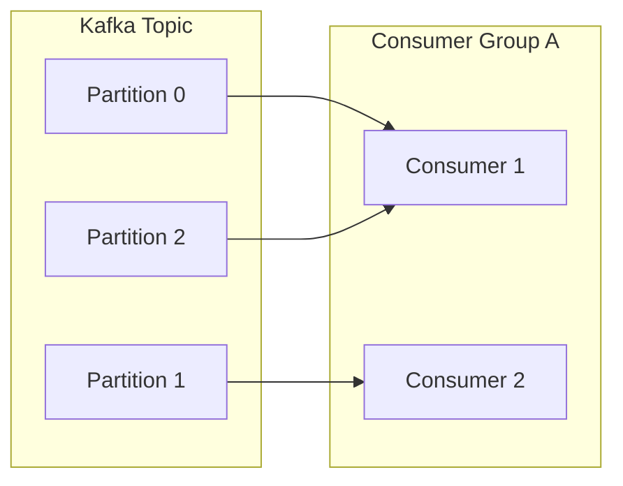
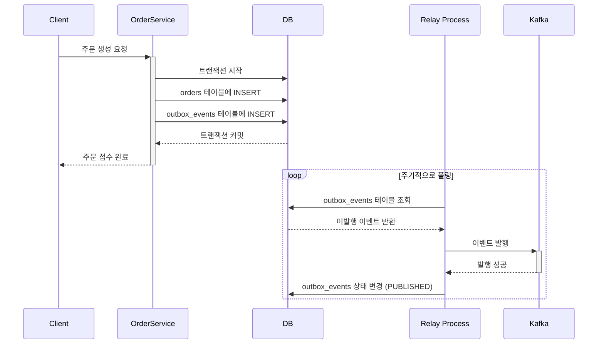

# 카프카 핵심 동작 원리

## 📜 목차

- [카프카란?](#카프카란)
- [카프카의 핵심 구성 요소](#1-카프카의-핵심-구성-요소)
- [2.브로커 내부 구조](#2-브로커-내부-구조)
- [3.컨슈머 동작 방식](#3-컨슈머-동작-방식)
- [4.Transactional Outbox Pattern](#4-transactional-outbox-pattern)

## 카프카란?
Apache Kafka는 대규모의 실시간 데이터 스트림을 안정적으로 처리하기 위해 설계된 분산 이벤트 스트리밍 플랫폼입니다. 높은 처리량 및 개발 효율을 위한 분산 시스템에서 고가용성과 유연함을 갖춘 연계 시스템으로 사용됩니다.

단순히 데이터를 한 곳에서 다른 곳으로 보내는 메시지 큐(Message Queue)를 넘어, 데이터를 지속적으로 저장하고, 여러 서버에 분산하여 관리하며, 장애가 발생해도 안정적으로 동작하는 강력한 시스템입니다.

### 주요 특징
- 높은 처리량(High Throughput): 초당 수백만 개의 메시지 처리 가능
- 확장성(Scalability): 수평적 확장을 통해 클러스터 규모 증설 가능
- 내결함성(Fault Tolerance): 데이터 복제를 통한 장애 대응
- 영속성(Durability): 디스크에 데이터를 저장하여 데이터 손실 방지
- 실시간 처리: 낮은 지연시간으로 실시간 데이터 스트리밍

### 주요 사용처
- 메시징 시스템 (Messaging System): 서비스 간의 비동기 통신을 위한 중앙 허브 역할을 합니다. 기존 메시지 큐(RabbitMQ, ActiveMQ 등)를 대체하여 MSA 환경에서 서비스 간의 결합도를 낮추는 데 효과적입니다.
- 실시간 스트림 처리 (Real-time Stream Processing): Kafka Streams나 Flink, Spark Streaming 같은 프레임워크와 연동하여, 실시간으로 유입되는 데이터를 변환, 집계, 분석하는 데 사용됩니다. (예: 실시간 사기 탐지, 개인화 추천)
- 로그 집계 (Log Aggregation): 여러 서버에서 발생하는 대규모 로그 데이터를 카프카로 중앙 집중화하여, ELK 스택이나 다른 분석 시스템으로 안정적으로 전달하는 데이터 파이프라인을 구축합니다.
- 이벤트 소싱 (Event Sourcing): 시스템의 모든 상태 변화를 '이벤트'로 간주하고, 이 이벤트들을 카프카에 순서대로 기록합니다. 이를 통해 특정 시점의 상태를 완벽하게 복원하거나 시스템의 모든 변경 이력을 추적할 수 있습니다.

## 왜 카프카를 사용하는가?
카프카의 복잡한 구조에도 불구하고 많은 시스템이 카프카를 도입하는 이유는, 전통적인 방식(모놀로식)으로는 해결하기 어려운 현대적인 아키텍처(MSA)의 문제들을 효과적으로 해결해주기 때문입니다.

### 1. 서비스 간 결합도 분리 (Decoupling Services)
   마이크로서비스 아키텍처(MSA)에서 서비스들은 각자의 역할에 집중해야 합니다. 하지만 서비스 간에 직접 API를 호출(동기 통신)하면, 한 서비스의 장애나 변경이 다른 서비스에 직접적인 영향을 미치는 높은 결합도(Tightly Coupled) 문제가 발생합니다.

해결책: 카프카가 중간에서 버퍼(Buffer) 역할을 합니다. 서비스 A는 서비스 B의 상태와 상관없이 카프카에 이벤트만 발행하면 자신의 책임이 끝납니다. 서비스 B는 자신이 처리 가능한 시점에 카프카에서 이벤트를 가져와 처리합니다. 이를 통해 서비스들은 서로를 직접 알 필요 없이 **느슨하게 결합**(Loosely Coupled)됩니다.

### 2. 대규모 트래픽 처리 (Handling Traffic Spikes)
   특정 이벤트(예: 타임딜, 프로모션)가 발생하면 순간적으로 엄청난 양의 트래픽이 시스템으로 유입될 수 있습니다. 데이터베이스나 백엔드 서비스가 이 트래픽을 감당하지 못하면 전체 시스템 장애로 이어질 수 있습니다.

해결책: 카프카는 대용량 메시지를 디스크 기반으로 안정적으로 저장할 수 있어, 순간적인 트래픽 급증을 흡수하는 완충제 역할을 합니다. 프로듀서는 빠르게 메시지를 카프카에 쌓아두기만 하면 되고, 컨슈머는 자신의 처리 능력에 맞게 메시지를 점진적으로 가져가 처리할 수 있습니다.

### 3. 데이터 파이프라인 구축 (Building Data Pipelines)
   다양한 소스(웹 서버, 모바일 앱, DB 등)에서 발생하는 데이터를 한 곳으로 모아 분석하거나 여러 시스템으로 전달해야 할 때, 안정적인 파이프라인이 필요합니다.

해결책: 카프카는 여러 프로듀서로부터 데이터를 받아 중앙에서 관리하고, 여러 컨슈머 그룹이 이 데이터를 독립적으로 구독할 수 있게 해줍니다. 이를 통해 로그 수집, 데이터 분석, 머신러닝 등 다양한 목적을 위한 중앙 데이터 허브를 구축할 수 있습니다.

### 4. 이벤트 기반 아키텍처 구현 (Event-Driven Architecture)
   '어떤 상태가 변경되었다'는 사실 자체를 **이벤트**(Event)로 간주하고, 이 이벤트를 중심으로 시스템이 반응하고 동작하도록 만드는 아키텍처입니다.

해결책: 카프카는 이벤트 스트림을 저장하고 전파하는 데 최적화되어 있습니다. 서비스들은 특정 이벤트가 발생했음을 카프카에 발행하고, 해당 이벤트에 관심 있는 다른 서비스들이 이를 구독하여 다음 동작을 수행합니다. 이는 시스템을 더 유연하고 확장 가능하게 만듭니다.

## 1. 카프카의 핵심 구성 요소
카프카는 크게 데이터를 생산(Produce)하고, 저장 및 중개(Broker)하며, 소비(Consume)하는 세 가지 핵심 역할로 구성됩니다.


### 프로듀서 (Producer)
역할: 메시지(이벤트)를 생산하여 카프카 브로커에 적재(발행)하는 서비스 또는 클라이언트입니다.

동작: 특정 토픽(Topic)을 지정하여 메시지를 전송합니다. 필요에 따라 메시지 키(Key)를 설정하여, 동일한 키를 가진 메시지들이 항상 같은 파티션에 저장되도록 하여 처리 순서를 보장할 수 있습니다.

### 브로커 (Broker)
역할: 카프카의 서버 Unit으로, 프로듀서로부터 받은 메시지를 디스크에 안전하게 저장하고 컨슈머의 요청에 응답하여 메시지를 전송하는 중개자입니다.

동작: 하나 이상의 브로커가 모여 클러스터(Cluster)를 구성합니다. 클러스터는 데이터 복제(Replication)를 통해 높은 가용성을 보장하며, 브로커를 추가하는 것만으로 간단하게 시스템을 확장할 수 있습니다.

### 주요 내부 역할:

- BrokerController: 클러스터 내 브로커 중 하나가 담당하며, 다른 브로커들의 상태를 모니터링합니다. 특정 브로커에 장애가 발생하면, 해당 브로커가 담당하던 파티션의 리더(Leader) 역할을 다른 브로커에게 재분배합니다.
- Coordinator: 컨슈머 그룹을 모니터링합니다. 그룹 내 특정 컨슈머에 장애가 발생하면, 해당 컨슈머가 담당하던 파티션을 다른 컨슈머에게 재할당하는 리밸런싱(Rebalancing)을 수행합니다.

### 컨슈머 (Consumer)
역할: 브로커에 적재된 메시지를 읽어오는(소비하는) 서비스 또는 클라이언트입니다.

동작: 컨슈머 그룹(Consumer Group)이라는 하나의 팀 단위로 묶여서 동작합니다. 메시지를 읽을 때마다 파티션별로 오프셋(Offset)을 유지하여 처리했던 메시지의 위치를 추적합니다.

## 2. 브로커 내부 구조
### 토픽 (Topic) & 파티션 (Partition)
토픽: 메시지를 분류하는 주제별 카테고리입니다. (예: order-completed, user-signup)

파티션: 하나의 토픽을 여러 개로 나눈 데이터 저장소 단위입니다. 토픽에 저장되는 대용량의 데이터를 여러 파티션으로 분산하여 병렬로 처리할 수 있어, 전체 처리량을 크게 향상시킬 수 있습니다.


### 리플리케이션 (Replication): 데이터의 안정성 확보
리플리케이션은 특정 브로커에 장애가 발생하더라도 데이터를 유실하지 않도록, 각 파티션의 복제본을 다른 브roker에 만들어두는 기능입니다.

- 리더(Leader) 리플리카: 모든 읽기/쓰기 요청을 담당하는 원본 파티션입니다. 각 파티션은 오직 하나의 리더만 가질 수 있습니다.
- 팔로워(Follower) 리플리카: 리더의 데이터를 그대로 복제하여 백업하는 역할을 합니다. 평소에는 읽기/쓰기 요청에 관여하지 않습니다.
만약 리더가 있는 브로커에 장애가 발생하면, 팔로워 중 하나가 새로운 리더로 선출되어 중단 없이 서비스를 이어갑니다. (Failover)



### 메시지 키와 파티셔너 (Partitioner)
프로듀서는 메시지를 보낼 때, 파티셔너라는 구성 요소를 통해 어떤 파티션으로 보낼지 결정합니다.

메시지 키가 있는 경우: 파티셔너는 키의 해시 값을 계산한 뒤, hash(key) % (파티션 개수) 공식을 통해 특정 파티션을 결정합니다. 이 덕분에 동일한 키를 가진 메시지는 항상 같은 파티션으로 들어가 처리 순서가 보장됩니다. (예: userId를 키로 사용)

메시지 키가 없는 경우: 파티셔너는 라운드 로빈(Round-robin) 방식으로 여러 파티션에 메시지를 균등하게 분배하여 부하를 분산시킵니다.

## 3. 컨슈머 동작 방식
### 컨슈머 그룹 (Consumer Group)
하나의 토픽에 발행된 메시지를 여러 서비스(또는 여러 인스턴스)가 함께 소비하기 위해 그룹을 설정합니다.
- 병렬 처리: 같은 그룹 내의 컨슈머들은 토픽의 파티션들을 나눠서 처리하여 작업 속도를 높입니다.
- 독립적 소비 (Broadcast): 서로 다른 그룹은 같은 토픽의 메시지를 각자 독립적으로 처음부터 끝까지 모두 받아갈 수 있습니다.

### 핵심 규칙: 파티션과 컨슈머의 1:1 매핑
하나의 파티션은 같은 컨슈머 그룹 내에서 오직 하나의 컨슈머 인스턴스에 의해서만 소비됩니다.

이 규칙 덕분에 파티션 내의 데이터 처리 순서가 보장되고, 하나의 메시지가 중복으로 처리되는 것을 방지할 수 있습니다.


Consumer 1은 Partition 0과 Partition 2를 담당하고, Consumer 2는 Partition 1을 담당합니다. 만약 그룹에 Consumer 3이 추가되면 파티션 소유권이 재분배(리밸런싱)됩니다.

### 오프셋을 활용한 메시지 처리와 커밋
컨슈머는 오프셋(Offset) 이라는 위치 정보를 통해 메시지를 안정적으로 처리합니다.

오프셋(Offset)이란?

컨슈머가 특정 파티션에서 어디까지 메시지를 처리했는지를 나타내는 숫자 값입니다. 각 컨슈머 그룹은 토픽의 파티션별로 자신만의 오프셋을 가집니다.

'조회 → 처리 → 커밋' 사이클:

- 메시지 조회 (Poll): 컨슈머는 주기적으로 브로커에게 메시지를 요청(poll())합니다. 브로커는 해당 컨슈머 그룹이 마지막으로 커밋한 오프셋 위치를 확인하고, 그 다음 메시지부터 순차적으로 반환합니다.
- 메시지 처리: 컨슈머는 받아온 메시지 묶음을 애플리케이션 로직에 따라 처리합니다.
- 오프셋 커밋 (Commit): 메시지 처리가 성공적으로 완료되면, 컨슈머는 자신이 마지막으로 처리한 메시지의 오프셋을 브로커에 보고합니다. 이 과정을 **커밋**이라고 합니다. 브로커는 이 커밋된 오프셋 정보를 **__consumer_offsets**라는 내부 토픽에 안전하게 저장합니다.
- 중요성: 이 사이클 덕분에, 컨슈머에 장애가 발생했다가 재시작되어도 마지막으로 커밋된 위치부터 작업을 이어서 계속할 수 있습니다. 이는 데이터 유실이나 중복 처리를 방지하는 핵심 메커니즘입니다.

### 리밸런싱 (Rebalancing): 컨슈머 그룹의 동적 조정
리밸런싱은 컨슈머 그룹 내에서 파티션의 소유권을 재분배하는 과정입니다. 아래와 같은 상황에서 발생합니다.
- 새로운 컨슈머가 그룹에 추가될 때
- 기존 컨슈머가 그룹을 떠나거나 장애가 발생할 때
- 토픽의 파티션 수가 변경될 때
주의: 리밸런싱이 일어나는 동안에는 해당 컨슈머 그룹의 모든 컨슈머가 잠시 메시지 처리를 멈춥니다. 이를 **Stop-the-world**라고 부르기도 하며, 잦은 리밸런싱은 전체 처리량에 영향을 줄 수 있습니다.

## 4. Transactional Outbox Pattern
   MSA 환경에서 데이터베이스 업데이트와 카프카 메시지 발행을 함께 처리할 때, 둘 중 하나만 성공하고 다른 하나는 실패하면 데이터 정합성이 깨지는 '이중 쓰기(Dual Write)' 문제가 발생할 수 있습니다. Transactional Outbox Pattern은 이 문제를 해결하는 효과적인 방법입니다.

### 문제 상황: 이중 쓰기 (Dual Write)
```java
// 문제가 있는 코드
@Transactional
public void createOrder(OrderRequest request) {
// 1. DB에 주문 저장 (트랜잭션 시작)
Order order = orderRepository.save(new Order(request));

    // 2. 메시지 발행 (DB 트랜잭션과 무관하게 동작)
    kafkaProducer.send("order.created", order); 

    // 만약 DB 트랜잭션이 커밋되기 전에 여기서 시스템이 다운되면?
    // -> DB에는 주문이 롤백되지만, Kafka에는 메시지가 이미 발행됨 (데이터 불일치!)
}
```

### 해결책: Outbox Pattern
이 패턴의 핵심은 비즈니스 데이터와 발행할 이벤트를 하나의 원자적인 트랜잭션으로 묶어 데이터베이스에 저장하는 것입니다.
- Outbox 테이블: 발행할 이벤트를 임시로 저장하는 outbox_events와 같은 별도의 테이블을 데이터베이스에 만듭니다.
- 원자적 저장: 서비스는 비즈니스 로직을 처리하면서 orders 테이블에 데이터를 저장하고, 동시에 outbox_events 테이블에 발행할 이벤트 내용을 같은 트랜잭션 내에서 저장합니다.
- 이벤트 발행: 별도의 비동기 프로세스(릴레이 또는 CDC)가 outbox_events 테이블을 주기적으로 확인하여, 'PENDING' 상태인 이벤트를 읽어 카프카로 안정적으로 발행합니다. 발행이 성공하면 해당 이벤트의 상태를 'PUBLISHED'로 변경합니다.

이 방식을 통해, 데이터베이스 트랜잭션이 성공해야만 발행할 이벤트도 함께 저장되므로, **최소 한 번 이상 발행**(At-least-once Delivery)을 보장하며 데이터 정합성을 유지할 수 있습니다.

