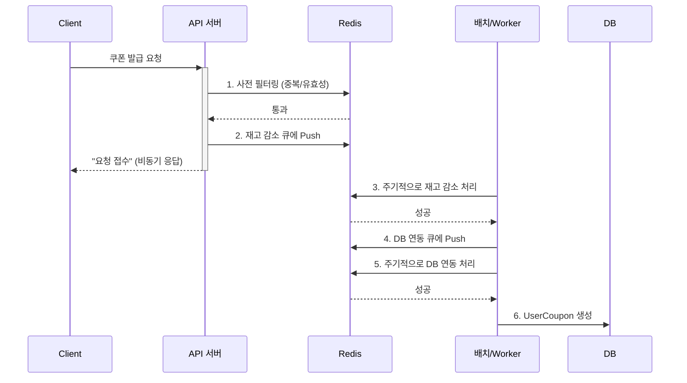
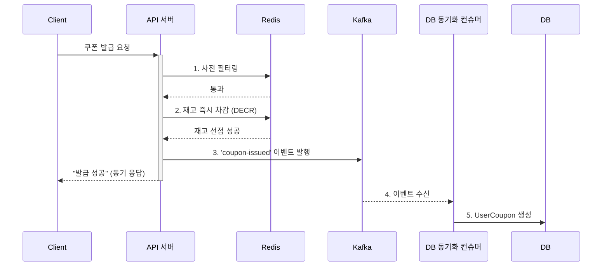

## 실시간 쿠폰 발급에 카프카를 적용하여 시스템 개선

### 기존 Redis 큐 방식
- 사전 필터링: Redis의 다양한 자료구조(String, Set, Bitmap)를 활용해 사용자의 중복 요청, 쿠폰 유효성 등을 빠르게 확인합니다.
- 단계별 큐: 필터링을 통과한 요청을 '재고 감소 큐'에 넣고, 재고 감소가 성공하면 다시 'DB 연동 큐'에 넣어 순차적으로 처리합니다.

기존 아키텍처는 API 서버가 Redis의 다양한 자료구조를 활용하여 실시간 필터링, 재고 관리, DB 연동까지의 모든 흐름을 제어합니다. 빠르지만, API 서버의 책임이 많고 DB 장애에 취약할 수 있습니다.

### 카프카 방식으로 변경

- 사전 필터링: Redis의 다양한 자료구조(String, Set, Bitmap)를 활용해 사용자의 중복 요청, 쿠폰 유효성 등을 빠르게 확인합니다.
- 재고 감소: 필터링된 요청을 즉시 재고감소하여 사용자가 동기 응답을 받을 수 있게 합니다.
- 메시지 발급: 요청 성공 이벤트를 발행하여 컨슈머에게 DB 연동 책임을 넘깁니다.

Redis와 Kafka를 사용한 하이브리드 아키텍처는 Kafka를 중간 버퍼로 활용하여 여러 이점을 제공합니다.
- 대규모 동시 요청이 DB에 직접 몰리는 것을 방지하여 데이터베이스 부하를 줄이고 시스템을 안정적으로 유지합니다.
- DB 장애 시에도 Kafka가 요청을 안전하게 보관하여 시스템 안정성과 회복력을 높입니다.
- '실시간 요청 처리'와 '후속 데이터 처리'의 책임이 분리되어 확장성이 향상됩니다. 예를 들어, 새로운 알림 기능 추가 시 기존 코드 수정 없이 새 컨슈머만 추가하면 됩니다.

이러한 구조에서 선착순 쿠폰의 정합성을 보장하기위해, 파티션 키를 couponId로 설정하여 동일한 쿠폰에 대한 요청이 순차적으로 처리되도록 설계 하였습니다.