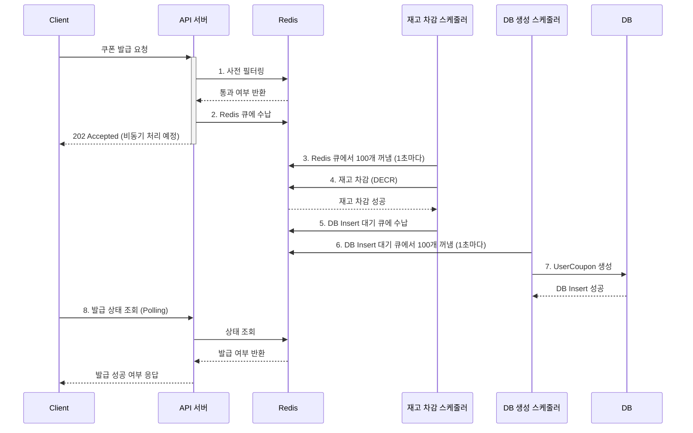
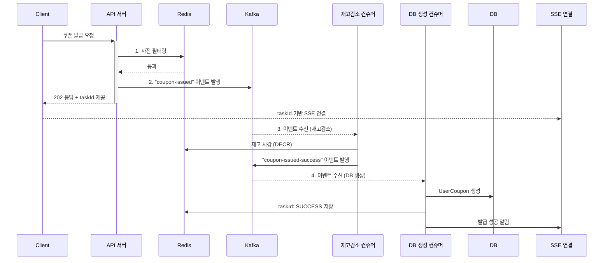

# 실시간 쿠폰 발급 구현: 아키텍처 개선 및 리팩토링

## 목차
1. [쿠폰 발급 시스템 소개](#1-쿠폰-발급-시스템-소개)
2. [아키텍처 비교: Before & After](#2-아키텍처-비교-before--after)
   1. [기존: Redis & Scheduler 기반 아키텍처](#기존-Redis--Scheduler-기반-아키텍처)
   2. [개선: Redis & Kafka & SSE 기반 비동기 아키텍처](#개선-redis--kafka--sse-기반-비동기-아키텍처)
3. [리팩토링 핵심 고려사항](#3-리팩토링-핵심-고려사항)
4. [향후 과제 및 대응 방안](#4-향후-과제-및-대응-방안)

## 1. 쿠폰 발급 시스템 소개
실시간 선착순 쿠폰 발급 시스템에서 가장 중요한 과제는,
대규모 트래픽이 발생하는 환경에서도 안정성과 데이터 정합성을 보장하는 것입니다.

해당 구현은 한정된 수량의 쿠폰을 다수의 사용자에게 선착순으로, 실시간으로 발급하는 것을 목표로 합니다.
첫번째 구현에서는 Redis의 빠른 처리 속도와 스케줄러를 활용한 아키텍처를 구축했지만,
카프카 도입에 따라 장애 상황에서도 데이터 유실 없이 안정적으로 이벤트를 처리하는 파이프라인을 구현하였습니다.

특히 사용자가 일시에 몰리는 피크 타임(peak time)에도 데이터의 정합성을 유지하고,
사용자에게는 지연 없이 정확한 발급 결과를 전달하는 것이 중요한 과제입니다.

## 2. 아키텍처 비교: Before & After
### 기존: Redis & Scheduler 기반 아키텍처
초기 모델은 Redis의 빠른 In-memory 처리 능력과 스케줄러를 활용한 배치(Batch) 처리 방식에 중점을 두었습니다.

사용자는 쿠폰 발급 요청을 보내면 서버는 즉시 요청을 Redis 큐에 저장하고, 202 Accepted 응답을 반환합니다. 이후 사용자는 주기적으로 서버에 발급 상태를 조회(Polling) 하여, Redis 큐와 스케줄러 처리 결과에 따라 발급 성공/실패 여부를 확인할 수 있습니다.

즉, 발급 요청과 최종 발급 완료 사이에는 시간 차이가 존재하며, 사용자가 직접 상태 조회를 반복해야만 결과를 알 수 있는 구조입니다. 

### 장점
- 빠른 응답 속도: 모든 요청을 일단 Redis 큐에 저장하고 즉시 응답하므로, 사용자는 대기 없이 빠른 초기 응답을 받을 수 있습니다.
- DB 부하 감소: 스케줄러가 주기적으로 작업을 모아 처리하므로, DB에 직접적인 트래픽이 몰리는 것을 방지합니다.

### 단점
- 복잡성 및 유지보수: 재고 차감, DB 저장 등 각기 다른 역할을 하는 스케줄러를 별도로 개발하고 관리해야 하므로 유지보수 포인트가 늘어납니다.
- 사용자 요청 유실 가능성: Redis 큐는 메모리 기반으로 동작하므로, Redis 장애 발생 시 큐에 대기 중이던 모든 사용자들의 '발급 요청' 자체가 유실될 수 있습니다. 이는 복구가 불가능하며, 시스템의 안정성을 크게 저해합니다.
- 비효율적인 결과 확인: 클라이언트는 자신의 발급 성공 여부를 알기 위해 주기적으로 서버에 요청을 보내야 합니다(Polling). 이는 서버에 불필요한 부하를 유발하고, 사용자 경험을 저해합니다.

 

### 개선: Redis & Kafka & SSE 기반 비동기 아키텍처
기존 아키텍처의 한계를 극복하고 시스템의 안정성과 확장성을 높이기 위해, 메시지 큐로 Kafka를, 실시간 알림 방식으로 SSE를 도입했습니다.

Kafka는 발급 요청을 안전하게 보관하고, Redis와 컨슈머는 재고 차감과 DB 저장을 비동기적으로 처리합니다.
사용자는 쿠폰 발급 요청 시 부여받은 taskId로 SSE 연결을 맺고, 컨슈머가 처리한 결과를 Redis와 SSE를 통해 전달받습니다.
이를 통해 클라이언트는 Polling 없이 실시간으로 발급 성공/실패 결과를 확인할 수 있습니다.

### 장점
- 높은 안정성 및 데이터 보존: Kafka는 디스크 기반으로 메시지를 저장하므로, 컨슈머나 DB에 장애가 발생해도 요청 데이터가 유실되지 않습니다. 시스템 복구 후 순차적으로 재처리가 가능합니다.
- 관심사 분리 및 확장성: '재고 차감', 'DB 저장', '알림' 등 각 역할이 컨슈머로 명확하게 분리됩니다. 추후 '발급 통계 집계'와 같은 새로운 기능이 필요할 때, 기존 코드에 영향을 주지 않고 새로운 컨슈머만 추가하면 되므로 확장성이 매우 뛰어납니다.
- 향상된 사용자 경험: 클라이언트는 Polling 대신 SSE 연결을 통해 자신의 발급 결과를 실시간 Push 알림으로 받을 수 있습니다. 이는 서버 부하를 줄이고 사용자 만족도를 높입니다.

### 단점
- 초기 구축 복잡성: Redis 스케줄러 방식에 비해 추가적인 인프라 구축이 필요합니다.
- 결과 확인 지연: 모든 처리가 비동기로 이루어지므로, 사용자가 최종 결과를 받기까지 약간의 지연(latency)이 발생할 수 있습니다.

## 3. 리팩토링 핵심 고려사항
이번 리팩토링에서 가장 중점적으로 고려한 사항은 다음과 같습니다.
- 시스템 안정성 (Reliability): 어떤 장애 상황에서도 사용자의 발급 요청이 유실되지 않아야 한다는 점을 최우선으로 고려했습니다. Kafka의 데이터 영속성과 재처리(Retry) 및 데드 레터 큐(DLQ) 패턴을 통해 안정성을 확보했습니다.
- 선착순 정합성 (Consistency): 대규모 동시 요청 속에서도 선착순이라는 비즈니스 로직이 깨지지 않도록 해야 했습니다. 이를 위해 Kafka Producer에서 쿠폰 ID를 파티션 키로 지정하여, 동일한 쿠폰에 대한 요청은 항상 동일한 파티션에서 순서대로 처리되도록 보장했습니다.
- 실시간 피드백 (Real-time Feedback): 비동기 처리의 단점인 '결과 확인의 어려움'을 해결하기 위해 SSE를 도입했습니다. 클라이언트가 taskId를 통해 자신의 요청 처리 과정을 실시간으로 추적하고 최종 결과를 즉시 알 수 있도록 하여 사용자 경험을 개선했습니다.

## 4. 향후 과제 및 대응 방안
현재 아키텍처는 안정적이지만, 트래픽이 폭발적으로 증가할 경우 발생할 수 있는 병목에 대한 대응 방안은 다음과 같습니다.

### DB 쓰기 병목 문제
재고 차감은 Redis에서 매우 빠르지만, 최종 결과를 DB에 저장하는 속도는 상대적으로 느립니다. 
DB 생성 컨슈머가 처리 속도를 따라가지 못하면 Kafka에 메시지가 계속 쌓이게 됩니다.

#### 대응 방안
1. 배치 처리(Batch Processing): DB 생성 컨슈머가 메시지를 한 건씩 처리하는 대신, 100건씩 모아서 DB에 **배치 삽입(Batch Insert)** 하도록 수정합니다. 
이는 DB와의 통신 횟수를 획기적으로 줄여 처리량을 극대화하는 가장 효과적인 방법입니다.
2. 컨슈머 스케일 아웃: Kafka 토픽의 파티션 수를 늘리고, 그에 맞춰 DB 생성 컨슈머의 인스턴스 수도 늘려 병렬 처리량을 높입니다.

### 전체 시스템 부하 증가
API 서버 또는 Kafka 컨슈머 자체의 CPU나 메모리 사용량이 한계에 도달하는 경우입니다.

#### 대응 방안
서버 스케일 아웃 (Scale-out): API 서버와 컨슈머 애플리케이션을 여러 대의 서버 인스턴스에 배포하여 부하를 분산합니다. 
Kafka는 컨슈머 그룹을 통해 스케일 아웃된 컨슈머들에게 자동으로 파티션을 재분배(Rebalancing)하여 안정적인 로드 밸런싱을 지원합니다.

## 5. 테스트 방법 및 주의사항
### 5.1 테스트 전략
안정적인 시스템 검증을 위해, 각 계층의 역할을 명확히 하는 테스트 전략을 수립했습니다.

#### 단위 테스트(Unit Test)
IssueCouponUseCaseTest와 같이 각 컴포넌트를 고립시켜 핵심 로직의 동작을 검증합니다.

Kafka 이벤트 발행 여부, Redis 재고 차감 호출 여부 등 개별 책임이 정상적으로 수행되는지 확인하는 데 집중합니다.

#### 통합 테스트(End-to-End Test)

IssueCouponE2ETest와 같이 실제 운영 환경과 동일하게 Redis, DB, Kafka를 모두 연동하여 전체 시나리오를 검증합니다.

정상 발급, 중복 요청, 재고 소진 등 다양한 케이스와 더불어, 동시성 문제까지 포함한 포괄적인 테스트를 진행합니다.

### 5.2 동시성 테스트 구현
대규모 트래픽 상황을 시뮬레이션하기 위해, 여러 스레드에서 동시에 마지막 남은 쿠폰 1개를 요청하도록 구현했습니다.

비동기 처리 대기: Kafka 컨슈머의 비동기 처리를 안정적으로 테스트하기 위해 Awaitility 라이브러리를 사용했습니다.

검증 조건: DB에 발급된 쿠폰이 정확히 1건 저장되는 조건을 만족할 때까지 최대 3초간 대기하며, 시간 내 조건이 만족되면 즉시 테스트를 성공 처리합니다.

테스트 범위: SSE를 통한 실시간 알림은 테스트 범위에서 제외하고, 데이터베이스의 최종 상태를 기준으로 데이터 정합성에만 집중했습니다.

### 5.3 주의사항
Kafka 비동기 처리

Kafka 이벤트는 비동기적으로 처리되므로, Producer가 이벤트를 발행한 직후 결과가 바로 반영되지 않습니다. 테스트 코드에서는 반드시 await().atMost() 와 같은 대기 로직을 사용해 최종 결과를 안정적으로 검증해야 합니다.

데이터 정합성

재고가 0일 때 쿠폰 발급을 시도하면 INACTIVE_COUPON 예외가 발생합니다. 동시 요청 시 단 1명만 성공하고 나머지는 해당 예외로 실패하는지 명확히 검증해야 합니다.

테스트 격리

각 테스트는 서로에게 영향을 주지 않도록, 매 테스트 실행 전 @BeforeEach 등을 통해 Redis와 DB의 데이터를 완전히 초기화해야 합니다.