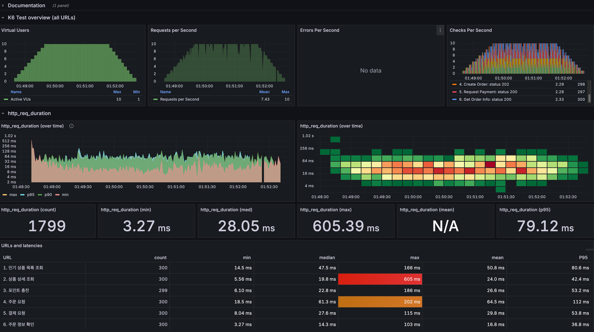

# 부하 테스트 및 성능 개선 문서

## 목차
1. [Step 19: 부하 테스트 계획 및 시나리오 설계](#step-19-부하-테스트-계획-및-시나리오-설계)
2. [Step 20: 부하 테스트 수행 및 문제 분석](#step-20-부하-테스트-수행-및-문제-분석)
---

## Step 19: 부하 테스트 계획 및 시나리오 설계

### 1.1 테스트 목적 및 대상 선정

#### 테스트 대상 API 선정
1. **인기 상품 조회** (`GET /api/products/rank/5`)
2. **상품 상세 조회** (`GET /api/products/{productId}`)
3. **포인트 충전** (`POST /api/users/{userId}/points`)
4. **주문 생성** (`POST /api/orders`)
5. **결제 처리** (`POST /api/payments`)
6. **주문 정보 확인** (`GET /api/orders/{orderId}`)

#### 선정 이유
- **핵심 비즈니스 플로우**: 인기 상품 조회 -> 상품 정보 조회 → 주문 → 결제의 전체 프로세스
- **높은 트랜잭션 빈도**: 실제 서비스에서 가장 많이 호출되는 API들
- **데이터 일관성 중요**: 포인트 차감, 재고 관리 등 ACID 특성이 중요한 영역

### 1.2 시나리오 설계

#### 사용자 시나리오
```
1. 사용자가 인기 상품 목록을 조회한다
2. 관심 있는 상품을 선택하여 상세 정보를 확인한다
3. 구매를 위해 포인트를 충전한다
4. 상품을 주문한다
5. 포인트로 결제를 진행한다
6. 주문 완료 후 주문 정보를 확인한다
```

### 1.3 테스트 환경 설정

#### 시스템 사양
- **애플리케이션 서버**: Spring Boot (Java)
- **데이터베이스**: MySQL/H2
- **메모리**: JVM Heap 설정
- **네트워크**: 로컬 Docker 환경

#### 테스트 데이터 준비
- **테스트 사용자**: 10명 (userId: 1-10)
- **상품 데이터**: 인기 상품 5개
- 
### 1.4 성능 목표 설정

#### 목표 지표
- **응답 시간 (P95)**: 1초 이하
- **처리량 (RPS)**: 50 RPS 이상

---

## Step 20: 부하 테스트 수행 및 문제 분석



## 결과 해석
### 2.1 테스트 결과 및 분석
테스트 결과 전반적으로 우수한 성능을 보였으나 일부 API에서 간헐적인 성능 저하 현상이 발견되었습니다.

#### 긍정적인 결과
평균 응답 시간: 28.05ms로 목표치(500ms)를 크게 하회하는 우수한 성능을 보였습니다.

안정적인 요청 처리 능력 확인

총 요청 수: 테스트 동안 총 1,799개의 요청을 안정적으로 처리했습니다.

에러율 0%: "Errors Per Second" 패널에 데이터가 없는 것으로 보아, 단 한 건의 에러도 없이 모든 요청이 성공적으로 처리되었습니다.

처리량(RPS): 초당 평균 7.43건의 요청을 꾸준히 처리하며, 부하 프로파일에 따라 안정적으로 유지되었습니다.

#### 개선이 필요한 부분 (병목 지점 분석)
상품 상세 조회 API의 간헐적 성능 저하 <br>
문제점: 이 API는 최대 응답 시간(Max)이 605ms로, 전체 시나리오 중 가장 큰 병목 지점으로 확인되었습니다.<br>
분석: 평균(19.8ms)과 P95(79.12ms)는 매우 빠르지만 최대값이 유독 튀는 것은, 평소에는 빠르지만 특정 상황에서 순간적으로 지연이 발생하고 있음을 의미합니다.

### 2.2 향후 개선 방안: 서버 사이드 메트릭 분석 도입
현재 InfluxDB 기반의 모니터링 환경은 k6의 테스트 결과만 보여주므로, 간헐적 성능 저하(Max 응답 시간 급증)의 근본 원인을 서버 내부에서 찾기 어렵다는 한계가 있습니다.

이 문제를 해결하기 위해, 모니터링 스택을 Prometheus로 전환하여 Spring Boot 애플리케이션의 내부 지표(JVM, CPU, DB Connection Pool 등)를 직접 수집하고 분석하는 것을 다음 단계의 개선안으로 제안합니다.

내부 지표 확인 후 분석된 원인을 바탕으로 쿼리 개선 및 커넥션 풀 사이즈 조정 등 쿠체적인 최적화 작업을 진행할 예정입니다.