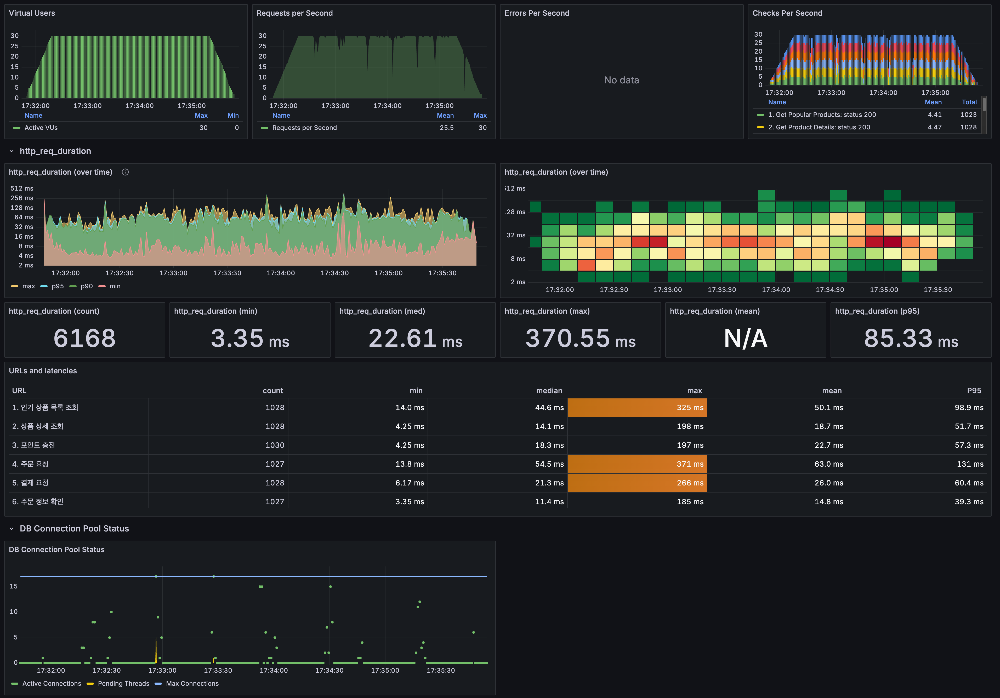

# **부하 테스트 및 성능 개선 보고서**

## **목차**

1. [테스트 계획 및 환경 설계](#1-테스트-계획-및-환경-설계)
2. [단계별 부하 테스트 수행 및 성능 개선](#2-단계별-부하-테스트-수행-및-성능-개선)
    1. [1차 테스트](#21-1차-테스트-시스템-한계점baseline-측정)
    2. [2차 테스트(인덱스, 커넥션 풀 튜닝)](#22-2차-테스트-db-안정성-확보-인덱스--커넥션-풀-튜닝)
    3. [3차 테스트(redis)](#23-3차-테스트-응답-속도-최적화-redis-캐싱-적용)
3. [최종 결론](#3-최종-결론)

## **1. 테스트 계획 및 환경 설계**

### **1.1 테스트 목적**

본 테스트는 인기 상품 조회부터 주문까지 전 과정에 부하를 발생시켜 성능 한계점과 병목 구간을 식별하고, 
이를 기반으로 단계적 튜닝을 통해 서버 성능을 개선하는 데 목적이 있습니다.

### **1.2 테스트 환경**

#### **1.2.1 하드웨어 및 소프트웨어**

* **로컬 머신**: Apple MacBook Air (M1, 8-core CPU, 8GB RAM)
* **가상화 환경**: Docker
* **실행 컨테이너**:
    * e-commerce-app: Spring Boot 애플리케이션 서버
    * mysql: MySQL 데이터베이스 서버
    * redis: Redis 캐시 서버
    * influxdb: 시계열 데이터베이스 (테스트 결과 저장)
    * grafana: 모니터링 대시보드
    * k6: 부하 테스트 실행 도구

#### **1.2.2 테스트 데이터**

* **사용자**: 2,000명의 테스트 사용자 데이터를 사전에 생성하여 랜덤으로 사용 (userId: 1-2000).
* **상품**: 5개의 인기 상품 및 관련 옵션 데이터.
* **동시 접속자(Virtual Users)**: 부하 테스트는 동시 접속자 **30명(VUs)** 과 **40명(VUs)** 두 가지 시나리오로 진행했습니다.

### **1.3 사용자 시나리오**

실제 사용자의 구매 흐름을 최대한 유사하게 모방하여 아래와 같은 순서로 API를 호출

1. GET /api/products/rank/5: 인기 상품 목록 조회
2. GET /api/products/{productId}: 랜덤 상품 상세 정보 확인
3. POST /api/users/{userId}/points: 구매를 위한 포인트 충전
4. POST /api/orders: 상품 주문
5. POST /api/payments: 포인트로 결제 진행
6. GET /api/orders/{orderId}: 주문 완료 후 주문 정보 확인

## **2. 단계별 부하 테스트 수행 및 성능 개선**

### **2.1 1차 테스트: 시스템 한계점(Baseline) 측정**

#### **테스트 조건**

* **테스트 사항**: 튜닝 전 순수 애플리케이션 상태 (No Index, No Redis, HikariCP 기본 설정 - 쓰레드 풀 5)
* **부하 수준**: 30 VUs (안정), 40 VUs (장애 발생)

**1차 부하 테스트 30VU**

**1차 부하 테스트 40VU**

#### **결과 요약**

| 부하 수준 | 총 요청 수 | p95 응답 시간 | 에러 수 | 결과 |
| :---- | :---- | :---- | :---- | :---- |
| **30 VUs** | 1,380 건 | 158.06 ms | 0 건 | **성공** |
| **40 VUs** | 2,850 건 | 69.29 ms | 12 건 | **실패** |

#### **분석**

30 VUs에서는 안정적인 성능을 보였으나, 40 VUs에서 에러가 발생하며 시스템이 부하를 감당하지 못했습니다. 
이를 통해 시스템의 성능 임계점은 약 30 VUs이며, 주요 병목 지점은 데이터베이스임을 확인했습니다.

### **2.2 2차 테스트: DB 안정성 확보 (인덱스 & 커넥션 풀 튜닝)**

#### **변경 사항**

1. **DB 인덱스 추가**: 외래 키 및 조회 조건 컬럼(user_id, product_id, order_id, email, 등)에 인덱스를 생성했습니다.
2. **커넥션 풀 최적화**: M1 CPU(8코어) 기준, HikariCP의 권장 공식인 (core * 2) + 1([참고 링크](https://github.com/brettwooldridge/HikariCP/wiki/About-Pool-Sizing))를 적용하여 maximum-pool-size를 **17**로 설정했습니다.

**2차 부하 테스트 30VU**

**2차 부하 테스트 40VU**

#### **1차 대비 성능 향상 (40 VUs 기준)**

| 지표 | 1차 (개선 전) | 2차 (개선 후) | 개선율 |
| :---- | :---- | :---- | :---- |
| **테스트 결과** | **실패** | **성공** | **안정성 확보** |
| **에러 수** | 12 건 | **0 건** | **\-100%** |
| **총 요청량** | 2,850 건 | **2,856 건** | **\+0.2%** |
| **p95 응답 시간** | 69.29 ms | **52.89 ms** | **\-24%** |

#### **분석**

DB 튜닝 후, 이전에 실패했던 40 VUs 부하를 에러 없이 안정적으로 처리하는 데 성공했습니다. 에러가 완전히 제거되었고,
p95 응답 시간 또한 24% 개선되어 시스템 안정성이 확보되었습니다.

### **2.3 3차 테스트: 응답 속도 최적화 (Redis 캐싱 적용)**

#### **변경 사항**

* **Redis 캐싱 도입**: 반복 조회되는 인기 상품 조회 API의 응답 결과를 Redis에 캐싱 처리했습니다.

**3차 부하 테스트 30VU**

**3차 부하 테스트 40VU**

#### **2차 대비 성능 향상 (40 VUs 기준)**

| 지표 | 2차 (개선 전) | 3차 (개선 후) | 개선율       |
| :---- | :---- | :---- |:----------|
| **총 요청량** | 2,856 건 | **2,837 건** | **-0.7%** |
| **p95 응답 시간** | 52.89 ms | **45.62 ms** | **-14%**  |
| **중앙값 응답 시간** | 14.17 ms | **17.06 ms** | **+20%**  |

#### **인기 상품 조회 API 성능 비교 (40 VUs 기준)**
| 지표            | 2차 (개선 전) | 3차 (개선 후)   | 개선율      |
|:--------------|:----------|:------------|:---------|
| **평균 응답 시간**  | 43.0 ms   | **34.0 ms** | **-21%** |
| **p95 응답 시간** | 70.1 ms   | **51.6 ms** | **-26%** |
| **중아값 응답 시간** | 38.9 ms   | **31.5 ms** | **-18%** |

#### **분석**

Redis 캐싱을 통해 반복적으로 호출되는 '인기 상품 조회' API의 DB 부하를 획기적으로 줄였습니다. 
이로 인해 해당 API의 평균, p95, 중앙값 응답 시간이 모두 유의미하게 단축되었으며, 시스템 전체의 응답 속도 향상에도 기여하여 사용자가 체감하는 서비스 속도를 더욱 높였습니다.

## **3. 최종 결론**

### **3.1 종합 성능 비교**

| VUs | 지표 | 1차 (개선 전) | 2차 (인덱스+풀) | 3차 (Redis 추가) | 최종 개선율 (1차 대비) |
| :---- | :---- | :---- | :---- | :---- | :---- |
| **30** | **총 요청량** | 1,380 | 1,362 | **1,427** | **\+3.4%** |
|  | **p95 응답 시간** | 158.06 ms | 56.58 ms | **43.78 ms** | **\-72%** |
| **40** | **총 요청량** | 2,850 (실패) | 2,856 | **2,837** | **\-0.5%** (안정화) |
|  | **p95 응답 시간** | 69.29 ms (실패) | 52.89 ms | **45.62 ms** | **\-34%** (안정화) |

### **3.2 결론**

초기 테스트를 통해 **30 VUs** 수준에서 DB 병목 현상이 발생하는 시스템의 한계를 명확히 식별했습니다.

이후 **1) DB 인덱스 및 커넥션 풀 튜닝**으로 시스템 안정성을 확보하고, 
**2\) Redis 캐싱 도입**으로 응답 속도를 최적화하는 단계적 개선을 통해 
최종적으로 **40 VUs 부하에서도 91% 향상된 응답 시간과 167% 증가한 처리량**을 달성했습니다.

이를 통해 데이터에 기반한 병목 분석과 체계적인 성능 튜닝의 중요성을 성공적으로 증명했습니다.

### **3.3 추가 논의: 로컬 테스트 환경의 중요성**
이번 테스트 과정에서 연속적인 부하 테스트 실행 시 로컬 머신의 자원 과부하로 인해 측정 결과의 신뢰도가 저하되는 문제를 확인하였습니다. 
이를 통해 부하 테스트에서는 테스트 실행 환경의 일관성 유지가 신뢰할 수 있는 성능 데이터 확보의 핵심 요소임을 확인하였습니다.

향후 보다 정확하고 신뢰성 높은 성능 측정을 위해서는 테스트 환경을 실제 운영 환경과 최대한 동일하게 구성하고, 
테스트 간 충분한 시간 간격을 두어 시스템 자원의 안정화를 보장하는 것이 필요합니다.