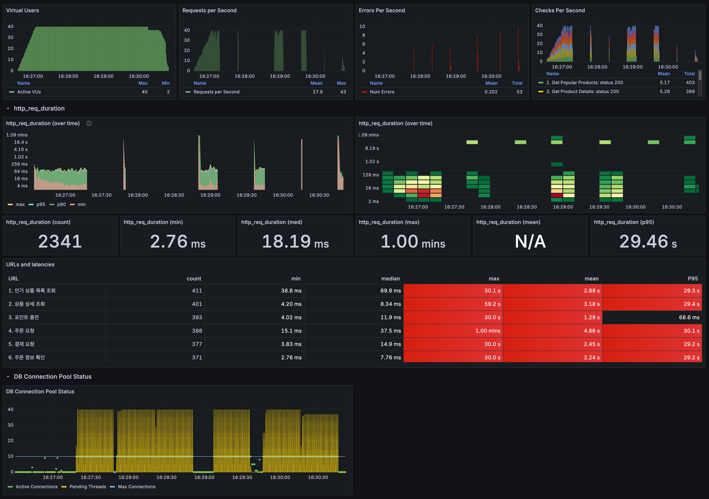
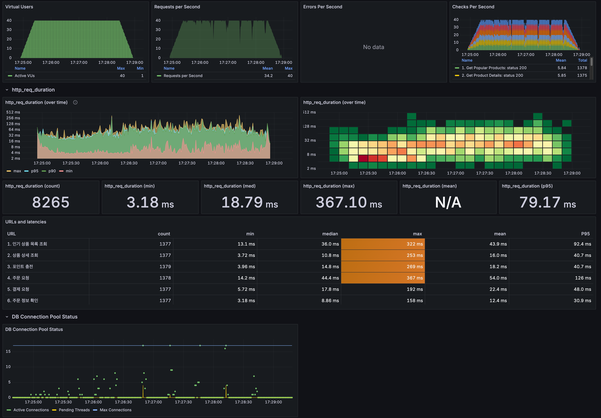

# **부하 테스트 및 성능 개선 보고서**

## **목차**

1. [테스트 계획 및 환경 설계](#1-테스트-계획-및-환경-설계)
2. [단계별 부하 테스트 수행 및 성능 개선](#2-단계별-부하-테스트-수행-및-성능-개선)
    1. [1차 테스트](#21-1차-테스트-시스템-한계점baseline-측정)
    2. [2차 테스트(커넥션 풀)](#22-2차-테스트-db-안정성-확보-커넥션-풀)
    3. [3차 테스트(redis)](#23-3차-테스트-인기상품-조회-redis-캐싱-적용)
    4. [4차 테스트(인덱스)](#24-4차-테스트-인덱스-적용)
3. [최종 결론](#3-최종-결론)

## **1. 테스트 계획 및 환경 설계**

### **1.1 테스트 목적**

본 테스트는 인기 상품 조회부터 주문까지 전 과정에 부하를 발생시켜 성능 한계점과 병목 구간을 식별하고, 
이를 기반으로 단계적 튜닝을 통해 서버 성능을 개선하는 데 목적이 있습니다.

### **1.2 테스트 환경**

#### **1.2.1 하드웨어 및 소프트웨어**

* **로컬 머신**: Apple MacBook Air (M1, 8-core CPU, 8GB RAM)
* **가상화 환경**: Docker
* **실행 컨테이너**:
    * e-commerce-app: Spring Boot 애플리케이션 서버
    * mysql: MySQL 데이터베이스 서버
    * redis: Redis 캐시 서버
    * influxdb: 시계열 데이터베이스 (테스트 결과 저장)
    * grafana: 모니터링 대시보드
    * k6: 부하 테스트 실행 도구

#### **1.2.2 테스트 데이터**

* **사용자**: 2,000명의 테스트 사용자 데이터를 사전에 생성하여 랜덤으로 사용 (userId: 1-2000).
* **상품**: 5개의 인기 상품 및 관련 옵션 데이터.
* **동시 접속자(Virtual Users)**: 부하 테스트는 동시 접속자 **30명(VUs)** 과 **40명(VUs)** 두 가지 시나리오로 진행.

### **1.3 사용자 시나리오**

실제 사용자의 구매 흐름을 최대한 유사하게 모방하여 아래와 같은 순서로 API를 호출

1. GET /api/products/rank/5: 인기 상품 목록 조회
2. GET /api/products/{productId}: 랜덤 상품 상세 정보 확인
3. POST /api/users/{userId}/points: 구매를 위한 포인트 충전
4. POST /api/orders: 상품 주문
5. POST /api/payments: 포인트로 결제 진행
6. GET /api/orders/{orderId}: 주문 완료 후 주문 정보 확인

## **2. 단계별 부하 테스트 수행 및 성능 개선**

### **2.1 1차 테스트: 시스템 한계점(Baseline) 측정**

#### **테스트 조건**

* **테스트 사항**: 튜닝 전 순수 애플리케이션 상태 (No Index, No Redis, HikariCP 기본 설정 - 쓰레드 풀 10)
* **부하 수준**: 
  * 30 ~ 40VUs
  * 총 4분 - 30초 동안 증가, 3분동안 유지, 30초동안 감소

##### **1차 부하 테스트 30VU**

##### **1차 부하 테스트 40VU**

#### **결과 요약**

| 부하 수준 | 총 요청 수  | p95 응답 시간 | 에러 수 | 결과 |
| :---- |:--------|:----------|:-----| :---- |
| **30 VUs** | 6,165 건 | 98.95 ms  | 0 건  | **성공** |
| **40 VUs** | 2,341 건 | 29.46 s   | 53 건  | **실패** |

#### **분석**

30 VUs에서는 시스템이 안정적으로 동작했습니다. 요청 처리 성공률이 높았고, 에러는 거의 발생하지 않았습니다.

40 VUs에서는 53건의 에러가 발생했습니다. 모니터링 결과, DB 커넥션 풀의 pending thread 수가 40으로 올라가면서 요청이 대기 상태에 들어가 많은 요청이 타임아웃으로 에러가 발생하였습니다.

이를 통해 시스템의 성능 한계점은 약 30~40 VUs로 추정되며, 주요 병목 지점은 데이터베이스 커넥션 풀임을 확인할 수 있습니다.

### **2.2 2차 테스트: DB 안정성 확보 (커넥션 풀)**

1차 테스트에서 병목 지점이었던 데이터 베이스 커넥션 풀을 증가하여 다시 테스트했습니다.

#### **변경 사항**

[//]: # (1. **DB 인덱스 추가**: 외래 키 및 조회 조건 컬럼&#40;user_id, product_id, order_id, email, 등&#41;에 인덱스를 생성했습니다.)
커넥션 풀 최적화: M1 CPU 기준(로컬 머신 8코어), HikariCP 권장 공식 (core * 2) + 1 을 적용하여 minimum-idle과 maximum-pool-size를 모두 17로 설정했습니다.([참고 링크](https://github.com/brettwooldridge/HikariCP/wiki/About-Pool-Sizing))

최소/최대 풀을 동일하게 설정함으로써, 커넥션 생성/소멸 과정에서 발생할 수 있는 불필요한 오버헤드를 제거하고, 커넥션이 줄거나 추가될 때 낭비되는 리소스를 최소화했습니다.

##### **2차 부하 테스트 30VU**

##### **2차 부하 테스트 40VU**

#### **1차 대비 성능 향상 (40 VUs 기준)**

| 지표 | 1차 (개선 전) | 2차 (개선 후)    | 개선율         |
| :---- |:----------|:-------------|:------------|
| **테스트 결과** | **실패**    | **성공**       | **안정성 확보**  |
| **에러 수** | 53 건      | **0 건**      | **100% 감소** |
| **p95 응답 시간** | 29.46 s   | **121.70 ms** | **99.6% 감소**   |

#### **분석**
1차 테스트에서 40 VUs 부하 발생 시 시스템은 거의 마비 상태에 이르렀으며, p95 시간은 29.46초, 53건의 요청이 실패했습니다.

DB 커넥션 풀을 17로 조정한 이후 시스템은 안정화되었고, 모든 에러가 사라졌으며 p95 응답 시간은 121.70ms로 크게 단축되어 이를 통해 시스템 안정성이 확보했습니다.

### **2.3 3차 테스트: 인기상품 조회 Redis 캐싱 적용**

#### **변경 사항**

* **Redis 캐싱 도입**: p95가 163ms로 가장 느리고 빈번하게 호출되는 인기 상품 목록 조회 API가 DB에 지속적인 부하를 주고 있어 해당 API의 응답 결과에 Redis 캐싱을 도입했습니다.

[//]: # (**3차 부하 테스트 30VU**)
[//]: # (![3차 부하 테스트 30]&#40;../picture/test3_30vu.png&#41;)
##### **3차 부하 테스트 40VU**

#### **2차 대비 성능 향상 (40 VUs 기준)**

| 지표                 | 2차 (Before Redis) | 3차 (After Redis) | 개선율        |
|:-------------------|:------------------|:-----------------|:-----------|
| **p95 응답 시간**      | 121.70 ms         | **79.17 ms**     | **35% 감소** |
| **최대 응답 시간(max)**  | 584.45 ms         | **367.10 ms**    | **37% 감소** |

#### **인기 상품 조회 API 성능 비교 (40 VUs 기준)**
| 지표                    | 2차 (Before Redis) | 3차 (After Redis) | 개선율        |
|:----------------------|:------------------|:-----------------|:-----------|
| **평균 응답 시간(mean)**    | 95.0 ms           | **43.9 ms**      | **54% 감소** |
| **p95 응답 시간**         | 163 ms            | **92.4 ms**      | **43% 감소** |
| **중앙값 응답 시간(median)** | 90.0 ms           | **36.0 ms**      | **60% 감소** |

#### **분석**

API 성능 향상: 캐싱 적용 후 인기 상품 목록 조회 API의 평균 응답 시간이 54%, 중앙값 응답 시간이 60% 단축되었습니다.

시스템 안정성 개선: 데이터베이스 부하가 감소하여 p95 응답 시간과 최대 응답 시간이 각각 35%, 37% 단축되었으며, 서비스 지연 현상이 감소하였습니다.

확장성 확보: 데이터베이스가 빈번한 읽기 작업에서 해방되어 주문·결제 등 핵심 쓰기 작업에 자원을 집중할 수 있게 되었으며, 향후 트래픽 증가에 대비할 수 있는 기반을 마련하였습니다.

### **2.4 4차 테스트: 인덱스 적용**

#### **변경 사항**

* **DB 인덱스 도입**: 상품 상세 조회 API의 쿼리가 풀 테이블 스캔(type: ALL)으로 실행되는 것을 확인하고, 향후 성능 저하를 방지하기 위해 관련 컬럼에 `product_id`인덱스를 추가하여 쿼리 실행 계획을 최적화했습니다. 

##### **4차 부하 테스트 40VU**

##### **EXPLAIN 전후 비교**

#### **3차 대비 성능 향상 (40 VUs 기준)**
| 지표 | 3차 (Before Index) | 4차 (After Index) |  개선율  |
|:---|:---:|:----------------:|:-----:|
| 최대 응답 시간 (max) | 253 ms |      165 ms      | 35%감소 |
| p95 응답 시간 | 40.7 ms |     39.9 ms      | 2%감소  |
| 평균 응답 시간 (mean)| 16.0 ms |     15.3 ms      | 4%감소  |

#### **분석**
EXPLAIN 기반 분석을 통해 풀 테이블 스캔으로 발생하던 비효율을 확인하고, 관련 컬럼에 인덱스를 추가했습니다. 
그 결과, 최대 응답 시간은 35% 단축되어 간헐적 DB 락 경합 문제가 해소되었으며, 
평균 및 p95 응답 시간도 소폭 개선되어 전반적인 사용자 경험이 향상되었습니다.

## **3. 최종 결론**

### **3.1 종합 성능 비교**

### **종합 성능 비교 (40 VUs 기준)**

| 지표 | 1차 (Baseline) | 2차 (커넥션 풀) | 3차 (Redis 추가) | 4차 (인덱스 추가) | 최종 개선율 (1차 대비) |
| :--- |:--------------|:-----------| :--- | :--- |:---------------|
| **에러 수** | 53 건          | 0 건        | 0 건 | **0 건** | **100% 감소**    |
| **p95 응답 시간**| 29.46 s       | 121.70 ms  | 79.17 ms | **75.48 ms** | **99.7% 감소**   |
| **RPS (평균)*** | ~9.7 (불안정)    | 33.7       | 34.2 | **34.1** | **252% 증가**    |

*1차 테스트의 RPS는 시스템 장애로 인해 대시보드 평균(27.9)이 왜곡되어, 실제 처리량(총 요청 수/시간)을 기준으로 계산함.

### **3.2 결론**

초기 테스트에서는 40 VUs 부하 시 p95 응답 시간이 29.46초에 달해 사실상 서비스 불능 상태였습니다.
특히, RPS는 요청 대기 및 끊김 현상으로 인해 27.9 수준에서 불안정하게 측정되었습니다.

이후 **DB 커넥션 풀 튜닝 → Redis 캐싱 → DB 인덱스 추가**라는 단계적 최적화를 통해:
- **에러율 완전 제거 (53건 → 0건, 100% 감소)**
- **p95 응답 시간 대폭 개선 (29.46s → 75.48ms, 99.7% 단축)**
- **RPS 안정화 및 성능 향상 (9.7 → 34.1, 252% 증가)**

라는 결과를 얻었습니다.

최종적으로, 초기에는 동시 사용자 40명 수준의 부하조차 감당하지 못하던 서비스가 단계적 최적화를 거쳐 
안정적으로 처리 가능한 구조로 개선되었음을 검증했습니다.

### **3.3 추가 논의: 로컬 테스트 환경의 중요성**
이번 테스트 과정에서 연속적인 부하 테스트 실행 시 로컬 머신의 자원 과부하로 인해 측정 결과의 신뢰도가 저하되는 문제를 확인하였습니다. 
이를 통해 부하 테스트에서는 테스트 실행 환경의 일관성 유지가 신뢰할 수 있는 성능 데이터 확보의 핵심 요소임을 확인하였습니다.

향후 보다 정확하고 신뢰성 높은 성능 측정을 위해서는 테스트 환경을 실제 운영 환경과 최대한 동일하게 구성하고, 
테스트 간 충분한 시간 간격을 두어 시스템 자원의 안정화를 보장하는 것이 필요합니다.
